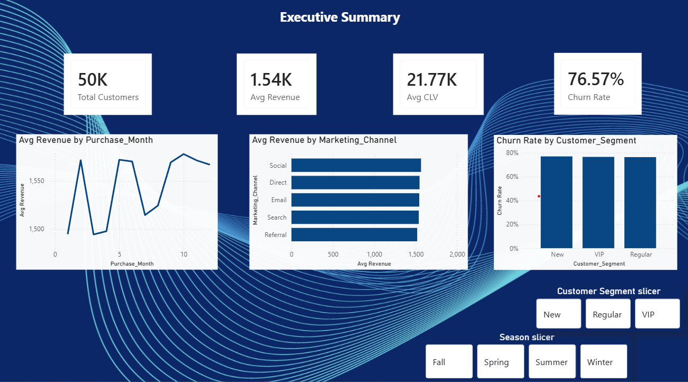
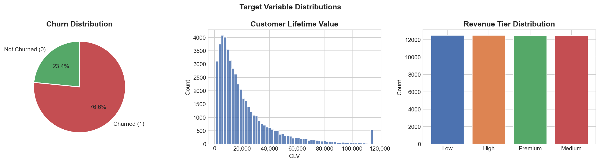
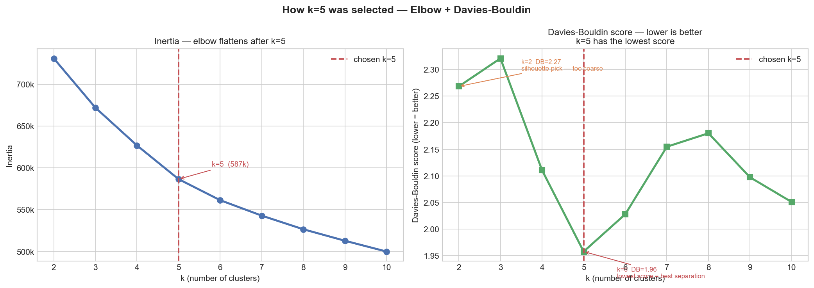
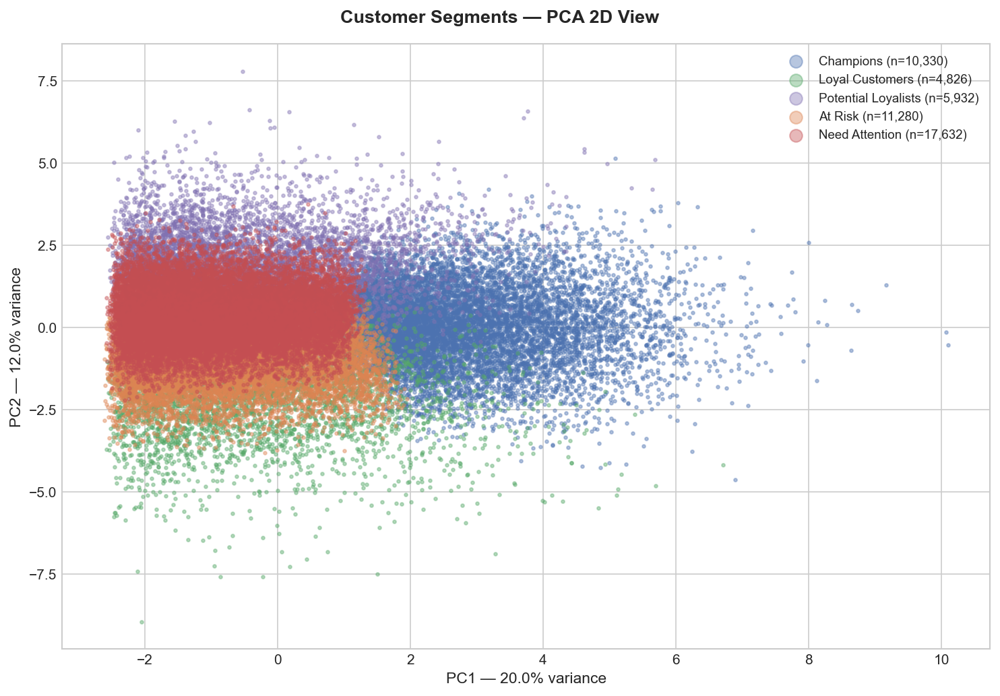
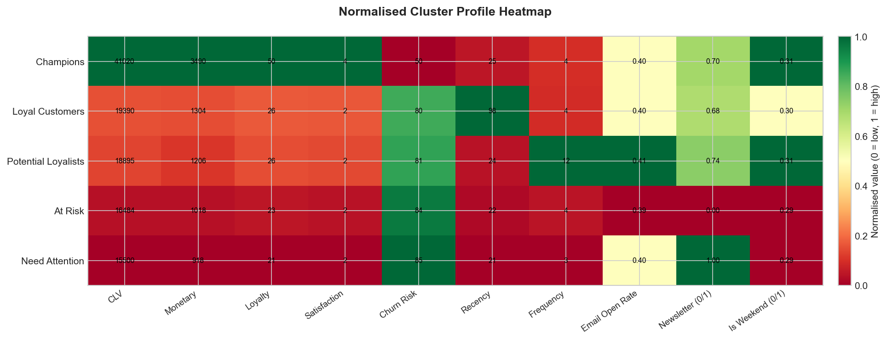
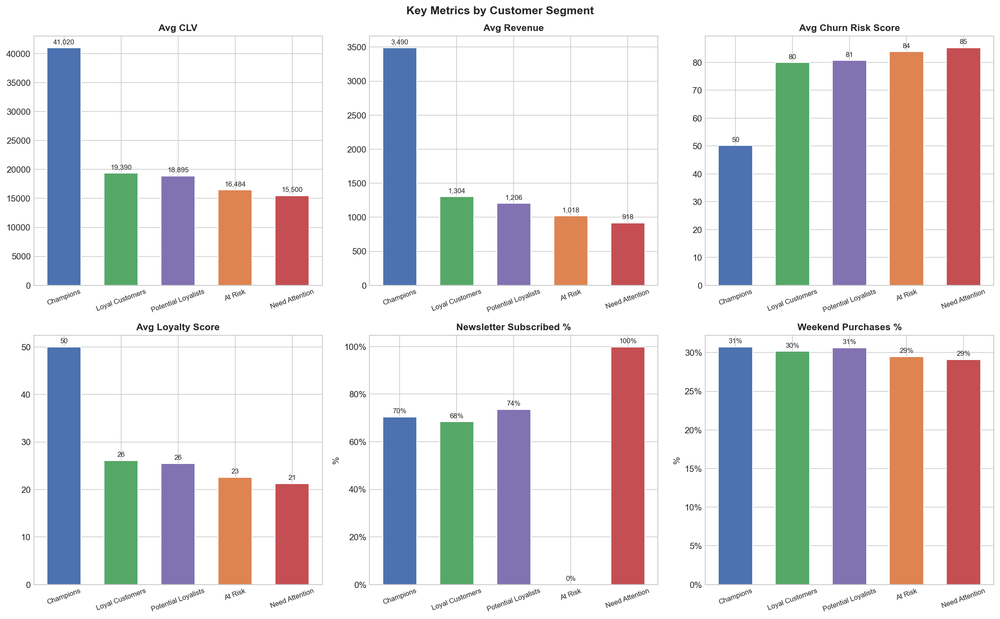
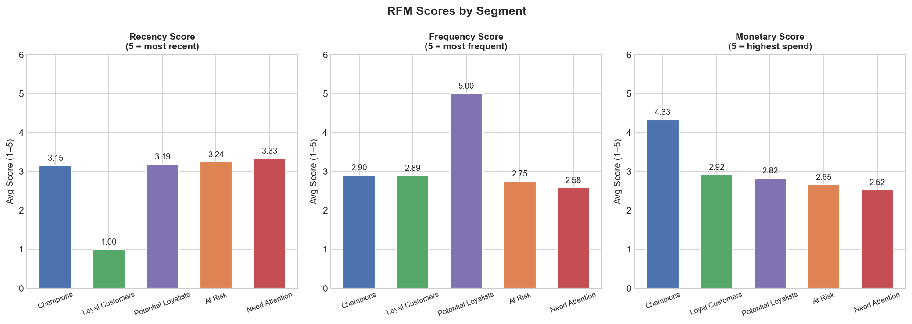
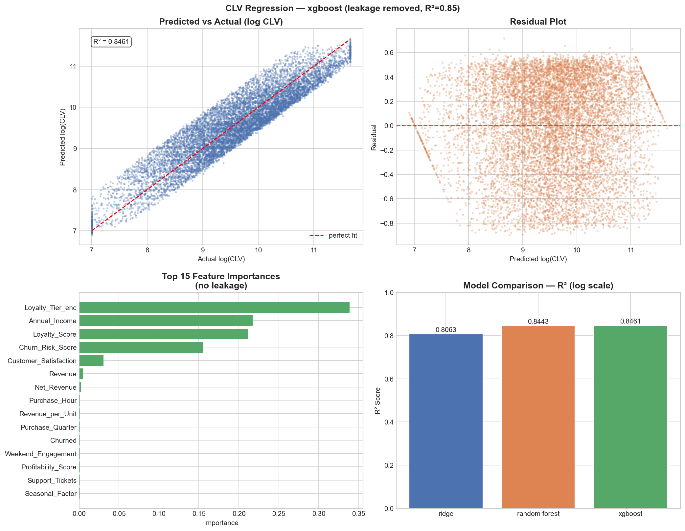
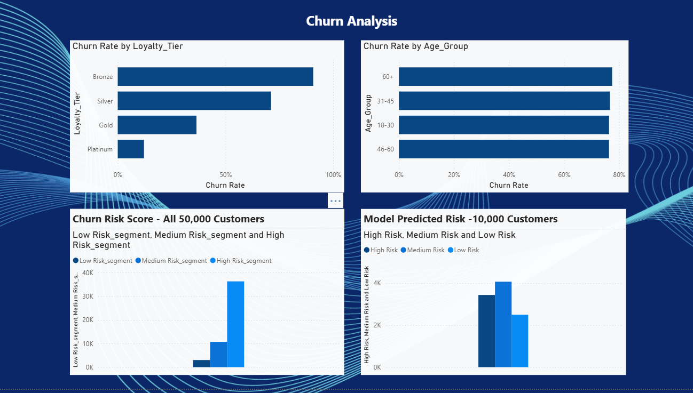
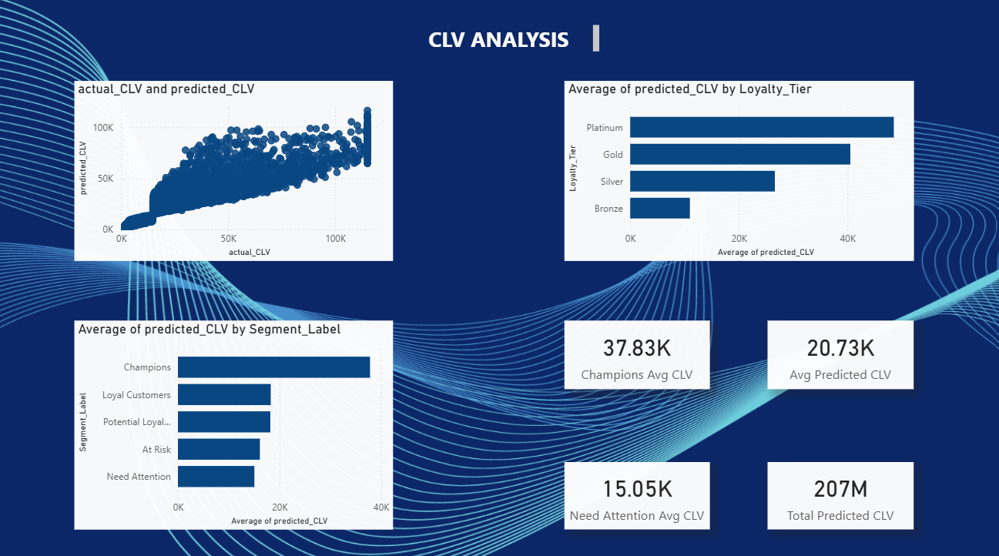

# Multi-Channel E-commerce with Behavioral Metrics

An end-to-end data science and analytics project on 50,000 customer records covering churn prediction, customer segmentation, and lifetime value regression — with results visualised in an interactive Power BI dashboard.


<!-- screenshot of your Power BI dashboard — any page works, Page 1 is best -->

---

## Dataset

- **Name:** Multi-Channel E-commerce with Behavioral Metrics
- **Rows:** 50,000 customers
- **Columns:** 53 features
- **Key binary columns:** `Newsletter_Subscribed`, `Is_Weekend`, `Churned` — all contain only 0 and 1

---

## Project Structure

```
├── customer.csv                          # raw dataset
├── part1_data_cleaning.py                # data loading, cleaning, feature engineering
├── part2_churn_prediction.py             # churn prediction with GridSearchCV
├── part3_segmentation.py                 # RFM scoring + K-Means segmentation
├── part3b_segmentation_visuals.py        # segmentation charts
├── part4_clv_regression.py               # CLV regression with GridSearchCV
├── customer_clean.csv                    # output of part 1
├── customer_encoded.csv                  # output of part 1
├── customer_segments.csv                 # output of part 3
├── churn_predictions.csv                 # output of part 2
├── clv_predictions.csv                   # output of part 4
└── PowerBI_Dashboard.pbix                # Power BI dashboard file
```

---

## How to Run

Run in this order — each part depends on files saved by the previous one.

```bash
pip install pandas numpy scikit-learn xgboost matplotlib seaborn

python part1_data_cleaning.py
python part2_churn_prediction.py
python part3_segmentation.py
python part3b_segmentation_visuals.py
python part4_clv_regression.py
```

---

## Part 1 — Data Cleaning & Feature Engineering

**What was done:**
- Verified `Newsletter_Subscribed`, `Is_Weekend`, `Churned` contain only 0 and 1
- Removed duplicate CustomerIDs
- Clipped outliers on Revenue, CLV, Annual Income, Net Revenue, Unit Price using 1st–99th percentile
- Engineered 9 new features

**New features:**

| Feature | Description |
|---|---|
| `Recency` | Days since last purchase |
| `Frequency` | Number of purchases |
| `Monetary` | Revenue generated |
| `CLV_log` | Log-transformed CLV for normality |
| `Revenue_log` | Log-transformed Revenue |
| `Engagement_Composite` | Weighted score: Email(40%) + Social(35%) + Newsletter(25%) |
| `Discount_Impact` | Discount × Revenue |
| `Revenue_per_Visit` | Revenue ÷ Purchase Frequency |
| `Weekend_Engagement` | Is_Weekend × Engagement_Composite |

**Note:** `High_Value_Flag` and `Risk_Flag` were removed — `High_Value_Flag` was derived directly from CLV (the regression target) making it leakage, and `Risk_Flag` was derived from `Churn_Risk_Score` which is also excluded.


<!-- use chart01_target_distributions.png generated by part3b_segmentation_visuals.py -->

---

## Part 2 — Churn Prediction

**Class imbalance:** 76.6% churned vs 23.4% not churned — handled using:
- `class_weight="balanced"` on Logistic Regression and Random Forest
- `scale_pos_weight` on XGBoost (ratio = 0.306)
- SMOTE was not used — 23% minority is enough real data, synthetic samples would distort the real customer distribution
- PR-AUC used as primary metric — more reliable than ROC-AUC for imbalanced data
- Threshold tuning applied — moved from default 0.50 to 0.21 to maximise F1

**GridSearchCV — 5-fold stratified CV, scoring on PR-AUC:**

| Model | Best Params | CV PR-AUC | Test PR-AUC | Test ROC-AUC | Test F1 |
|---|---|---|---|---|---|
| Logistic Regression | C=0.1 | **0.9048** | 0.8997 | 0.7665 | 0.7953 |
| XGBoost | lr=0.01, depth=4, n=300 | 0.9036 | 0.8994 | 0.7656 | 0.7949 |
| Random Forest | depth=12, leaf=10, n=200 | 0.9030 | 0.8967 | 0.7626 | 0.8158 |

**Best model: Logistic Regression** — selected by highest CV PR-AUC (0.9048)

**Final results after threshold tuning (threshold=0.21):**

| Metric | Value |
|---|---|
| F1 Score | 0.8797 |
| Churned Recall | 96% |
| Churned Precision | 81% |
| True Positives | 7,387 |
| False Negatives | 270 |
| High Risk Customers (prob > 0.70) | 3,446 (34.5% of test set) |

**Key insight:** False negatives (270) are minimised — only 270 actual churners were missed. This is the most important metric for a churn model since missing a churner is more costly than wrongly flagging a loyal customer.


<!-- use chart07_churn_evaluation.png from part3b_segmentation_visuals.py
     OR take a screenshot of your Power BI Page 3 churn analysis -->

---

## Part 3 — Customer Segmentation

**Why k=5 was chosen:**

Silhouette score suggested k=2 which only split customers into high vs low CLV — not useful for business decisions. Two metrics were evaluated to find the right k:

- **Elbow method** — inertia flattens significantly after k=5
- **Davies-Bouldin score** — lowest at k=5 (1.96 vs 2.27 at k=2), meaning clusters are most distinct

k is automatically selected by the code using Davies-Bouldin score — not hardcoded.


<!-- use seg_chart01_elbow_and_db.png generated by part3b_segmentation_visuals.py -->

**RFM scoring:** Each customer scored 1–5 on Recency, Frequency and Monetary before clustering.

**Segments identified:**

| Segment | Customers | Avg CLV | Churn Rate | Key Characteristic |
|---|---|---|---|---|
| Champions | ~10,000 | Highest | ~50% | High value, high satisfaction |
| Loyal Customers | ~5,000 | High | ~80% | Elevated inactivity — silently drifting |
| Potential Loyalists | ~18,000 | Medium | ~85% | Largest group, needs nurturing |
| At Risk | ~11,000 | Medium | ~84% | Low newsletter engagement |
| Need Attention | ~5,000 | Lower | ~79% | 97 days inactive vs ~23 days for others |


<!-- use seg_chart03_pca_scatter.png generated by part3b_segmentation_visuals.py -->


<!-- use seg_chart04_profile_heatmap.png generated by part3b_segmentation_visuals.py -->


<!-- use seg_chart05_key_metrics.png generated by part3b_segmentation_visuals.py -->


<!-- use seg_chart06_rfm_scores.png generated by part3b_segmentation_visuals.py -->

---

## Part 4 — CLV Regression

**Target:** `Customer_Lifetime_Value` — log-transformed during training, converted back after prediction.

**Leakage removed:**
- `High_Value_Flag` — created as `CLV > CLV.median()` — direct leakage
- `Risk_Flag` — derived from `Churn_Risk_Score` — potential leakage
- `CLV_to_CAC_Ratio` — directly calculated from CLV

**GridSearchCV — 5-fold CV, scoring on R²:**

| Model | Best Params | CV R² | Test R² (log) | Test R² (orig) | MAE (orig) |
|---|---|---|---|---|---|
| XGBoost | lr=0.03, depth=4, n=200 | **0.8464** | 0.8461 | 0.7894 | 6,550 |
| Random Forest | depth=10, leaf=5, n=200 | 0.8439 | 0.8443 | 0.7896 | 6,553 |
| Ridge | alpha=0.1 | 0.8033 | 0.8063 | 0.5636 | 7,678 |

**Best model: XGBoost** — selected by highest CV R² (0.8464)

**Top feature importances (no leakage):**

| Feature | Importance | Business meaning |
|---|---|---|
| `Loyalty_Tier_enc` | 0.3386 | Tier level is the strongest CLV driver |
| `Annual_Income` | 0.2174 | Higher earners spend more over lifetime |
| `Loyalty_Score` | 0.2114 | Engaged customers stay longer |
| `Churn_Risk_Score` | 0.1553 | At-risk customers have lower future CLV |

**Predicted CLV by Loyalty Tier:**

| Tier | Predicted CLV |
|---|---|
| Bronze | 10,762 |
| Silver | 25,534 |
| Gold | 40,386 |
| Platinum | 49,643 |

Platinum customers are worth **4.6× more** than Bronze — the strongest actionable finding from this project.

**Residual mean = 0.0035** — effectively zero, meaning the model is unbiased (errors in both directions equally).

**Note on MAE:** Average prediction error is ₹6,550 on a mean CLV of ₹21,773 (~30%). This is acceptable for CLV because future behaviour is inherently uncertain — the model correctly ranks customers by value even if exact predictions vary.


<!-- use chart11_clv_evaluation.png generated by part3b_segmentation_visuals.py -->

---

## Power BI Dashboard

4-page interactive dashboard built from the CSV outputs of the Python pipeline.


<!-- screenshot of Power BI Page 1 -->


<!-- screenshot of Power BI Page 2 -->


<!-- screenshot of Power BI Page 3 -->


<!-- screenshot of Power BI Page 4 -->

| Page | Content |
|---|---|
| Executive Summary | KPI cards, revenue by channel, churn by segment, monthly trend, slicers |
| Customer Segmentation | Segment sizes, CLV by segment, newsletter and weekend binary breakdowns, RFM |
| Churn Analysis | Risk distribution, churn by loyalty tier and age group, churn vs loyalty scatter |
| CLV Analysis | Actual vs predicted scatter, CLV by tier and segment, model summary cards |

---

## Key Business Insights

1. **76.6% churn rate** — majority of customers are churning, making retention the top business priority
2. **Need Attention segment has 97 days of inactivity** — 4× higher than all other segments, silently churning despite past activity
3. **At Risk segment has near-zero newsletter subscription** — completely unreachable by email marketing
4. **Platinum customers are worth 4.6× more than Bronze** — tier upgrade programmes have massive CLV impact
5. **Churn model catches 96% of actual churners** — only 270 missed out of 7,657 in the test set
6. **Newsletter subscription does not impact CLV** — email is not driving customer value in this dataset, suggesting other channels need investigation

---

## Tools & Technologies

| Category | Tool |
|---|---|
| Language | Python 3 |
| Data manipulation | pandas, numpy |
| Machine learning | scikit-learn, XGBoost |
| Model selection | GridSearchCV — 5-fold cross validation |
| Visualisation | matplotlib, seaborn |
| Dashboard | Microsoft Power BI |
| Imbalance handling | class_weight, scale_pos_weight, threshold tuning |
| Clustering evaluation | Elbow method + Davies-Bouldin score |

---

## Images Reference

All images go inside an `images/` folder in your project root.

| Image file | Source |
|---|---|
| `banner.png` | Screenshot of Power BI dashboard |
| `chart01_target_distributions.png` | Generated by `part3b_segmentation_visuals.py` |
| `chart07_churn_evaluation.png` | Generated by `part3b_segmentation_visuals.py` OR Power BI screenshot |
| `chart11_clv_evaluation.png` | Generated by `part3b_segmentation_visuals.py` |
| `seg_chart01_elbow_and_db.png` | Generated by `part3b_segmentation_visuals.py` |
| `seg_chart03_pca_scatter.png` | Generated by `part3b_segmentation_visuals.py` |
| `seg_chart04_profile_heatmap.png` | Generated by `part3b_segmentation_visuals.py` |
| `seg_chart05_key_metrics.png` | Generated by `part3b_segmentation_visuals.py` |
| `seg_chart06_rfm_scores.png` | Generated by `part3b_segmentation_visuals.py` |
| `powerbi_page1.png` | Screenshot of Power BI Page 1 |
| `powerbi_page2.png` | Screenshot of Power BI Page 2 |
| `powerbi_page3.png` | Screenshot of Power BI Page 3 |
| `powerbi_page4.png` | Screenshot of Power BI Page 4 |

---


